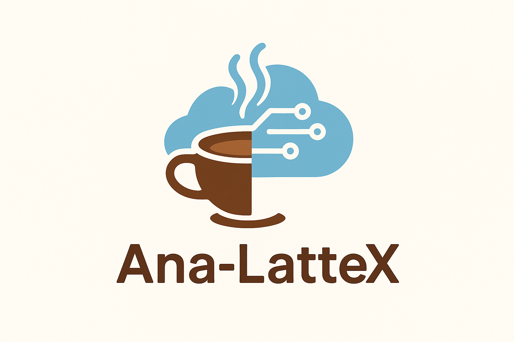

<p align="center">
  
</p>

# Super Café ETL Pipeline

**This repository is for the Super Café Project by Ana-LatteX**  
*Ana-LatteX — Automated ETL & BI*

---

## Summary
Fully automated ETL pipeline (local & AWS): ingest daily branch CSVs, clean and normalize transaction and order data, load into PostgreSQL (local) or Redshift (AWS). Visualize trends and insights with Grafana dashboards for branch and product performance.

---

## Table of Contents
1. [Overview of the Project](#overview-of-the-project)  
2. [Repository Contents](#repository-contents)  
3. [Simplified Explanation for Stakeholders](#simplified-explanation-for-stakeholders)  
4. [System Architecture & Data Flow](#system-architecture--data-flow)  
5. [Pipeline Workflow](#pipeline-workflow)  
6. [Getting Started for Developers](#getting-started-for-developers)  
7. [Deployment Instructions](#deployment-instructions)  
8. [Configuration and Secrets Management](#configuration-and-secrets-management)  
9. [Monitoring & Analytics](#monitoring--analytics)  
10. [Testing & Quality Checks](#testing--quality-checks)  
11. [Future Improvements](#future-improvements)  
12. [Team Contacts](#team-contacts)  

---

## Overview of the Project
This ETL pipeline automates the ingestion, transformation, and storage of daily transaction data from multiple café branches. Key benefits:

- Centralized storage of branch transactions  
- Standardized data format for analytics  
- Real-time business insights via Grafana  
- Scalable architecture supporting AWS deployment and local testing  

---

## Repository Contents

```.
├── AWS/                  # AWS deployment scripts
├── Database/             # Database schema and scripts
├── Sample Data 2/        # Sample CSV files
├── data/                 # Raw CSV files
├── doc/                  # Documentation
├── etl/                  # ETL pipeline code
├── src/                  # Source code
├── test/                 # Unit tests
├── .Ana-lattex_Logo.png  # Team logo
├── .env                  # Environment variables
├── .gitignore            # Git ignore rules
├── README.md             # Project documentation        
└── ana-lattex.md         # Additional documentation
```


---

## Simplified Explanation for Stakeholders
- Each branch produces a daily CSV file.  
- Current reporting is manual and per-branch.  
- The Ana-LatteX ETL pipeline automates ingestion and loading into a central database.  
- Grafana dashboards provide branch- and product-level analytics, enabling faster decision-making.  

**High-level vision:**  
`Daily CSV → Automated ETL → Central Database → Grafana BI Dashboards`


## System Architecture & Data Flow

**ETL Flow Overview:**


| Local ETL Diagram | AWS ETL Diagram |
|-----------------|-----------------|
|  |  |

**Diagram Descriptions:**

- **Local ETL Diagram:** Shows the local pipeline where branch CSVs → Transformation Script → PostgreSQL Database → Local analytics/reporting.
- **AWS ETL Diagram:** Shows the data flow from branch CSVs → S3 Raw Bucket → Lambda ETL → Cleaned Data in S3 → Grafana dashboards for analytics.

 
**Database Schema:** 

- `branches`  
  - `branch_id` UUID **PK**  
  - `branch_name` TEXT **UNIQUE**  

- `products`  
  - `product_id` UUID **PK**  
  - `product_name` TEXT  
  - `price` NUMERIC  
  - **Constraint:** Unique on (`product_name`, `price`)  

- `orders`  
  - `order_id` UUID **PK**  
  - `datetime` TIMESTAMP  
  - `branch_id` UUID **FK → branches(branch_id)**  
  - `payment_type` TEXT  
  - `total_price` NUMERIC  

- `order_items`  
  - `order_item_id` UUID **PK**  
  - `order_id` UUID **FK → orders(order_id)**  
  - `product_id` UUID **FK → products(product_id)**  
  - `quantity` INTEGER (default 1)  
  - `item_price` NUMERIC (optional: quantity × product price)  

---
---

## Pipeline Workflow

The Ana-LatteX ETL pipeline supports **two independent workflows**: one for **local testing** and another for **AWS/cloud deployment**.  
**High-Level ETL Flow (Separate Pipelines):**  
- **Local:** `Branch CSVs → Local ETL → PostgreSQL → Grafana`  
- **AWS:** `Branch CSVs → S3 → Lambda ETL → Redshift → Grafana`

---

### **A. Local ETL Pipeline**
Processes daily branch CSVs on a local machine and loads data into PostgreSQL.  

1. **File Detection:**  
   - Monitor a local folder for new CSV files.  

2. **Data Extraction:**  
   - Read CSV files using `etl.extract_csv()`.  
   - Validate structure and remove duplicates or corrupt rows.  

3. **Data Transformation:**  
   - Use `etl.transform_row()` to split orders and items.  
   - Generate UUIDs for branches, orders, and products.  
   - Normalize branch and product fields.  
   - Assign default `quantity = 1` if missing.  

4. **Database Preparation:**  
   - Create tables if missing using `sql_utils.create_db_tables()`.  
   - Ensures unique branches and products, and proper foreign key relationships.  

5. **Data Loading:**  
   - Insert unique branches (`branches`).  
   - Upsert unique products (`products`).  
   - Insert orders (`orders`) and link to branches.  
   - Insert order items (`order_items`) linked to orders and products.  

6. **Visualization:**  
   - Grafana dashboards visualize local database insights: sales per branch, top-selling products, daily revenue trends.  

---

### **B. AWS ETL Pipeline**
Processes daily branch CSVs in the cloud and loads data into S3 and Redshift for analytics.  

1. **File Detection / Trigger:**  
   - CSV files uploaded to an **S3 raw bucket** trigger **AWS Lambda** functions.  

2. **Data Extraction & Transformation:**  
   - Lambda extracts CSV data and transforms it using the same rules as local ETL:  
     - Split orders and items  
     - Generate UUIDs  
     - Normalize branch and product data  
     - Assign default `quantity = 1`  

3. **Data Loading:**  
   - Store cleaned data in **S3 processed bucket**.  
   - Load transformed data into **Redshift** for analytics.  

4. **Deployment & Monitoring:**  
   - **CloudFormation** automates Lambda, S3, and IAM setup.  
   - **CloudWatch** logs Lambda executions for monitoring and auditing.  

5. **Visualization:**  
   - Grafana dashboards show real-time insights: sales per branch, top-selling products, daily revenue trends.  

---


# ana-lattex-de-x6-generation

Project background: 
Our Cafe order application was a success, the client now wants to facilitate their unprecedented growth and expansion to hundreds of outlets.
The client wants to target new and returning customers to understand which of their products are best sellers.

Client requirements:
Current set up - 
*Each branch creates a CSV file of transactions daily at 8pm that are uploaded to software in back-office computers.
*To pull data for reporting, they have to manually collect the data from each location to collate, which is time consuming and it is difficult to colllect meaningful data for the company. 
*They would like a platform that will upload all the data to a centralised online location to allow for easier data manipulation and will help them identify trends to maxise revenue streams.

Consult results:
To resolve this data issue we will build a fully scalable ETL pipeline to handle large volumes of tranactional information.
This pipeline will collect all the transaction data generated by each individual cafe, and place it into a PostSQL database.
This will allow for easy access to relevant data to process, store and analyse.
New set up - 
* Each night a CSV for each branch will be uploaded to the cloud.
* The pipeline will read each file and Extract, Transform and Load the data.
* Data will be stored in a data warehouse.
* Data Analytics software will be used to create Business Intelligence analytics for the client.
* Application monitoring software used to produce operational metrics (i.e. system errors, up-time, etc).

how to run the app:
locally -

How to run the Super Cafe app (file based) Prerequisites - Python 3 this can be downloaded from https://www.python.org/

Download the project: If using Git clone the repository by using the code below;

git Clone (https://github.com/DE-X6-LM/ana-lattex-de-x6-generation.git)

If downloaded as a .zip file, extract this and navigate to the ana-lattex-de-x6-generation directory.

It is recommended to create a virtual envirnoment to help manage project dependencies

To create a virtual envirnoment:

python -m venv venv

Then activate this: Windows: .\venv\Scripts\activate or .\venv\Scripts\activate.ps1

MacOS/Linux: source venv/bin/activate

Once active your command prompt will now show (venv) at the beginning.

local (PostgresSQL) database -

pip install will not be needed for exteral libraries, however this would be useful for when using a database and scalability.

Running the application:

Ensure virtual envirnoment is active
Navigate to root directory of Super Cafe app:
cd ana-lattex-de-x6-generation

Run main app file:
main.py

This will show the main menu and you can use the on screen prompt to navigate the menus and manage food items, orders and couriers.

Data persistence:
All changes made in the apps menus will be automatically saved to the CSV files in the data directory. Dependant on the connection chosen, this is also handled by the local Postgres database and the AWS Redshift cloud database as it will allow for larger volumes of data to be saved without affecting the app.

How to run any unit tests:


Week 1 Sprint:
Scrum master Prajakta 

Week 2 Sprint:
Scrum master Rahidur

Week 3 Sprint:
Scrum master Kimira

Week 4 Sprint:
Scrum master Michael

Week 5 Sprint 
Scrum master TBC


